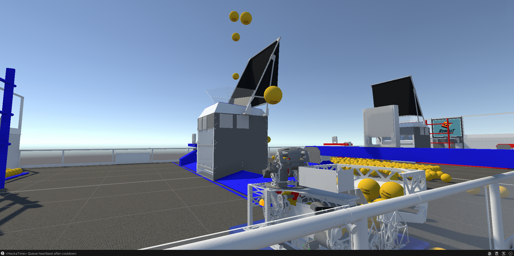

# FieldSimulator

A high-performance Unity simulation game for anyone to test and drive FRC robots for the 2026 Rebuilt season.

[Download release here!](https://thecheetoman.github.io/FieldSim/)

## Quick Start
1. Download the latest release from [FieldSimulator's official website](https://thecheetoman.github.io/FieldSim/)
2. Unzip the zip file downloaded
3. Launch `FieldSim.exe`(Windows) or `chmod +x FieldSim.x86_64 && ./FieldSim.x86_64`(Linux)

## Features
* **Full Rebuilt 2026 implementation:** All shifts have been implemented along with enabling/disabling the robot
* **Custom robot modding:** Well documented tutorial for modding custom robots through Unity editor
* **Full static and turret shooter support:** Turrets and static shooters are fully implemented, making it possible to make a massive array of robots
* **3 Example robots:** 2026 Kitbot, 9126 Silver Hawks, 9450 Velocity Raptors.

## Modding & Local Development

To modify the game or build custom robots:

### Prerequisites
* **Unity:** Version `2022.3.62f3`
* **Blender:** (Optional) For optimizing CAD files before import.

### Prerequisites
* **Unity:** Version 2022.3.62f3
* **Blender:** To optimize CADs(optional)
* **Python:** If you want to locally develop the website

### Local Setup
1. Clone the repository:
   ```bash
   git clone https://github.com/thecheetoman/FieldSim.git
   ```
2. Add project in Unity Hub, open it. To mod, read the [docs](https://thecheetoman.github.io/FieldSim/docs.html)
3. To test website:
```
cd website
python3 -m http.server
```
## Credits
* **FIRST®:** FIRST® and the FIRST Robotics Competition (FRC®) are registered trademarks of For Inspiration and Recognition of Science and Technology (FIRST), which is not affiliated with and does not endorse this project.
* **Team 9450 Velocity Raptors:** Special thanks to FRC Team 9450 for the CAD
* **Team 9126 Silver Hawks:** Special thanks to FRC Team 9126 for the CAD
* **Developer:** [@thecheetoman](https://github.com/thecheetoman)
